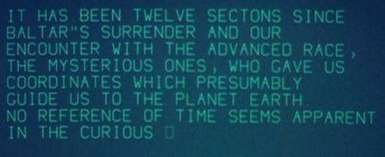

# Phosphor

Phosphor is a small tool to display text in an animated way,
like on a phosphorescent CRT terminal.

This was inspired by the system shown on
[Battlestar Galactica 1978](http://battlestar.popapostle.com/html/episodes/BSG70/The-Man-With-Nine-Lives.htm),
when commander Adama records his journal.



## Installing:

```
make install
```

