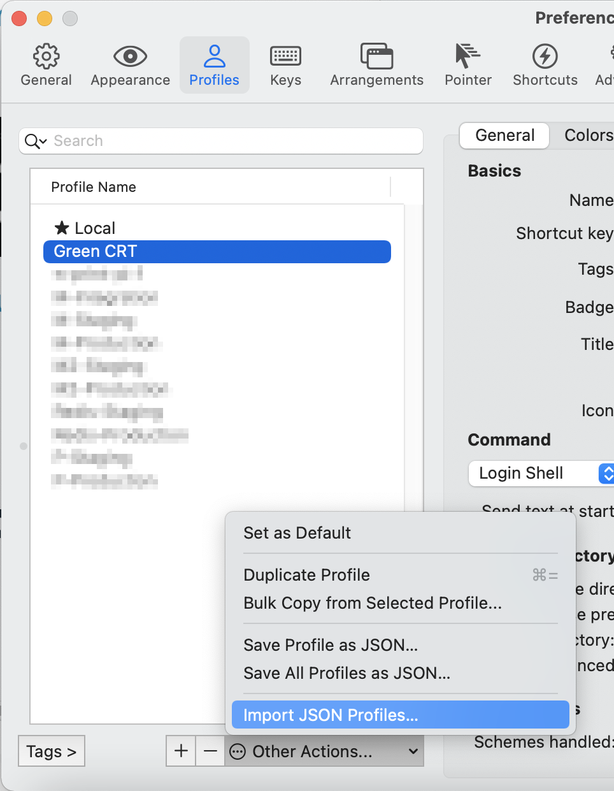

# iTerm2 Profile

## Configuration

 * Install the [Fixed font](Fixed.ttf) on the system.
 * Move the [background image](lines-on-green.png) file to some directory.
 * Edit the [JSON file](Green-CRT.json)
   * Change the path on [line 8](Green-CRT.json#L8) to the path of your home directory.
   * Change the path of the background image on [line 83](Green-CRT.json#L83).

## Importing the settings

 * In iTerm2, go to Profiles > Open Profiles... > Edit Profiles...
 * In the left pane, go to Other Actions > Import JSON Profiles...
 * Select the file to import.

